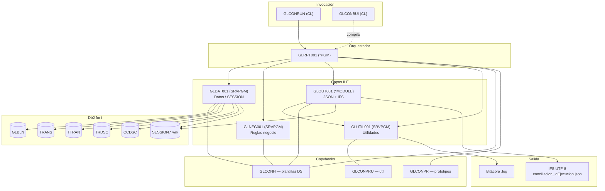

# Arquitectura IBM i — Conciliación GLBLN

Diagrama de componentes del proceso batch de conciliación (§15.2 requerimientos del taller).

## Vista de componentes

## Flujo de ejecución

1. **GLCONRUN** invoca **GLRPT001** con parámetros demo (banco, rango cuentas, fecha, ruta IFS base, tolerancia, modo).
2. **GLRPT001** genera `idEjecucion`, resuelve librería del programa, deriva ruta IFS trazable y abre bitácora.
3. **GLDAT001** inicializa tablas SESSION, abre cursor GLBLN y por cada cuenta carga movimientos, partidas y centro de costo.
4. **GLNEG001** calcula saldos, evalúa tolerancia, estado e incidentes de negocio.
5. **GLOUT001** arma el documento JSON (6 secciones raíz) y **GLUTIL001** lo escribe en IFS (CCSID 1208).
6. Errores tempranos o de IFS generan incidentes `CRITICA` (`ERR-TEC-001` … `003`) y JSON de error o reintento según el caso.

**Pruebas unitarias (batch aparte):** **GLCONUTS** invoca **GLNEGUT1**, que valida reglas de **GLNEG001** sin acceso a BD; escribe `glnegut1.log` en IFS.

## Referencias

- [Guia_Entrega_100_IBMi.md](Guia_Entrega_100_IBMi.md)
- [Requerimientos/requerimientos_taller.md](Requerimientos/requerimientos_taller.md)
- Fuentes: `src/rpg/`
